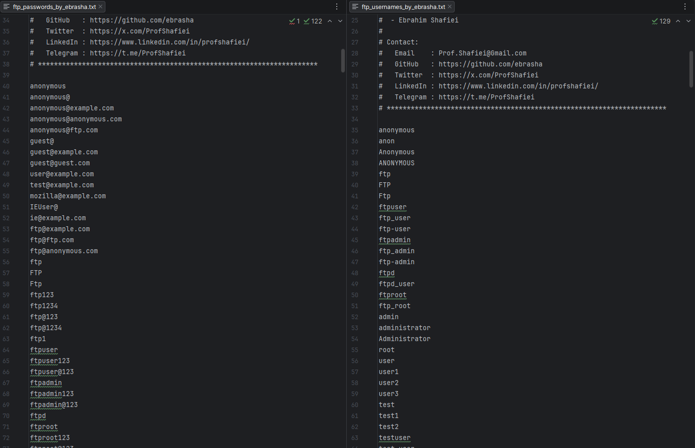

<!-- 
**********************************************************************
 Project Name : FTP Penetration Testing Wordlists
 File Name    : README.md
 Maintainer   : Ebrahim Shafiei (EbraSha)
 Email        : Prof.Shafiei@Gmail.com
 Created On   : 2026-05-25 08:00:46
 Description  : English documentation for the FTP penetration testing
                wordlists (usernames & passwords) crafted for
                authorized FTP / FTPS / SFTP security assessments.
**********************************************************************
-->

<div align="right">

> 🌐 **Read in your language:** 🇬🇧 [English](README.md) | 🇮🇷 [فارسی](README.fa.md)

</div>

<p align="right">
  
</p>

# 📂 FTP Penetration Testing Wordlists — High-Probability Usernames & Passwords for vsftpd, ProFTPD, Pure-FTPd, FileZilla Server, IIS FTP & Shared Hosting Brute Force

### 👤 Ebrahim Shafiei (EbraSha) 🇮🇷

A curated, real-world, high-signal wordlist pack tailored specifically for **authorized** penetration testing of **FTP, FTPS and SFTP** services on port `21` (and `990`, `2121`, custom ports). Built from breach corpora, vendor defaults, shared hosting panel patterns, anonymous-login conventions, and the most common webmaster/sysadmin habits observed in production environments.

---

## 📌 Why This Project Exists

Most public wordlists are **too large, too generic, and miss FTP-specific quirks**. FTP authentication has unique characteristics that make general-purpose lists inefficient:

- **Anonymous login** historically expects an email-shaped password, not a typical password string.
- **Shared hosting** (cPanel, Plesk, DirectAdmin, ISPConfig) creates FTP users with predictable site-based names.
- **fail2ban + CSF** ban source IPs after few failed attempts on most production hosts.
- **Webmasters reuse** a tiny, predictable set of patterns tied to their site/domain/year.

This project ships **two small, surgical, high-probability files** — maximizing the chance of a successful login per request and minimizing detection and bans.

---

## ✨ Features & Capabilities

- 🎯 **FTP-focused**: Tuned for vsftpd, ProFTPD, Pure-FTPd, FileZilla Server, Microsoft IIS FTP, WS_FTP, Serv-U.
- 🕵️ **Anonymous-login ready**: Includes the classic `anonymous` / `anonymous@`, `IEUser@`, `mozilla@example.com` password patterns.
- 🌐 **Shared hosting accounts**: cPanel, WHM, Plesk, DirectAdmin, ISPConfig, Vesta, Webuzo, Ajenti.
- 🛒 **CMS-specific accounts**: WordPress, Joomla, Drupal, Magento, OpenCart, PrestaShop, TYPO3, Moodle, Nextcloud, ownCloud, Seafile.
- 👥 **Webmaster & role-based**: `webmaster`, `webadmin`, `www-data`, `public_html`, `upload`, `backup`, `mirror`, `share`.
- 🏢 **Enterprise patterns**: Seasonal (`Summer2025!`), quarterly (`Q1@2026`) and monthly (`June2026`) passwords from rotation policies.
- 🔣 **Leetspeak & substitution patterns**: `P@55w0rd`, `4dm1n@123`, `r00t@123`.
- ⌨️ **Keyboard-walk passwords**: `1qaz2wsx`, `qweasdzxc`, `zaq1!QAZ`.
- 🌍 **Localized credentials**: Iran / Tehran / Persia-themed and common Persian first-name patterns.
- 📧 **Site-aware payloads**: `admin@example.com`, `ftp@domain.com` patterns commonly enforced as default.
- 📝 **Tool-friendly headers**: Comments prefixed with `#` so Hydra, Medusa, NetExec, Patator, Ncrack ignore them.

---

## 📁 Files in This Pack

| File | Purpose |
|---|---|
| `ftp_usernames_by_ebrasha.txt` | Anonymous, vendor, hosting-panel, CMS, role-based, and admin accounts |
| `ftp_passwords_by_ebrasha.txt` | High-probability real-world passwords (incl. anonymous-style email payloads) |

---

## 🚀 How To Use

> ⚠️ **STOP**: Use these wordlists ONLY against systems you **own** or have **explicit written authorization** to test.

### 🐉 Hydra (recommended for FTP)

```bash
hydra -L ftp_usernames_by_ebrasha.txt -P ftp_passwords_by_ebrasha.txt ftp://<target> -t 4 -W 5
```

### 🛡️ Ncrack

```bash
ncrack -vv --user ftp_usernames_by_ebrasha.txt -P ftp_passwords_by_ebrasha.txt ftp://<target>:21
```

### 🔧 Medusa

```bash
medusa -h <target> -U ftp_usernames_by_ebrasha.txt -P ftp_passwords_by_ebrasha.txt -M ftp
```

### 🧪 Patator (for FTPS / custom ports)

```bash
patator ftp_login host=<target> port=21 user=FILE0 password=FILE1 0=ftp_usernames_by_ebrasha.txt 1=ftp_passwords_by_ebrasha.txt -x ignore:mesg='Login incorrect'
```

### 🕵️ Anonymous-login Quick Check

```bash
nmap -p 21 --script ftp-anon <target>
```

### 💧 Recommended Strategy

1. **Always test anonymous first** — many production FTP servers still accept it.
2. Use **password spraying** (one password against all usernames) instead of vertical brute force.
3. Add **5+ seconds delay** between attempts when fail2ban is suspected.
4. On shared hosting, prefer usernames derived from the **domain name** (e.g., `example`, `exampleftp`, `example_user`).
5. Start with **vendor and seasonal defaults** for the highest hit rate.

---

## ⚠️ Legal & Ethical Notice

This wordlist is provided strictly for **authorized** security testing, red team operations, vulnerability assessments, and educational research. Using it without **explicit written permission** is **ILLEGAL** and may violate local, national, and international laws.

By using this file you agree that:

1. You possess explicit written authorization for every target.
2. You assume full legal and ethical responsibility.
3. The maintainer (Ebrahim Shafiei) bears **NO liability** for misuse.

---

## 🐛 Reporting Issues

If you encounter any issues or have configuration problems, please reach out via email at Prof.Shafiei@Gmail.com. You can also report issues on GitHub.

## ❤️ Donation

If you find this project helpful and would like to support further development, please consider making a donation:

- [Donate Here](https://t.me/AbdalDonationBot)

## 🤵 Maintained by

Maintained with Passion by **Ebrahim Shafiei (EbraSha)**

- **E-Mail**: Prof.Shafiei@Gmail.com
- **Telegram**: [@ProfShafiei](https://t.me/ProfShafiei)
