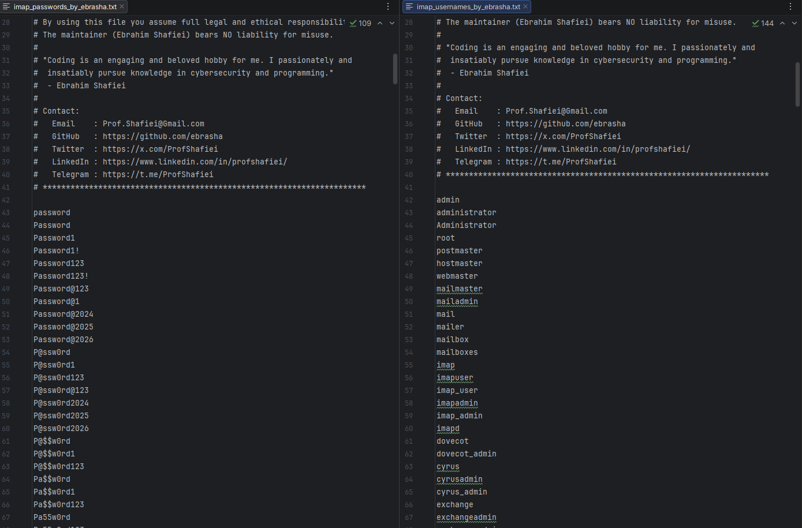

<!-- 
**********************************************************************
 Project Name : IMAP Penetration Testing Wordlists
 File Name    : README.fa.md
 Maintainer   : Ebrahim Shafiei (EbraSha)
 Email        : Prof.Shafiei@Gmail.com
 Created On   : 2026-05-25 08:00:46
 Description  : Persian (Farsi) documentation for the IMAP penetration
                testing wordlists (usernames & passwords) crafted for
                authorized IMAP / IMAPS security assessments.
**********************************************************************
-->

<div align="right">

> 🌐 **مطالعه به زبان شما:** 🇬🇧 [English](README.md) | 🇮🇷 [فارسی](README.fa.md)

</div>

<p align="right">
  
</p>

<div dir="rtl">

# 📥 وردلیست تست نفوذ IMAP — محتمل‌ترین نام‌های کاربری و رمزهای عبور برای Brute Force روی Dovecot، Cyrus، Exchange، Zimbra، M365 و cPanel Mail

### 👤 ابراهیم شفیعی (EbraSha) 🇮🇷

یک پک وردلیست دقیق، واقع‌گرا و با سیگنال بالا، طراحی‌شده به‌طور اختصاصی برای تست نفوذ **مجاز** سرویس‌های **IMAP / IMAPS** روی پورت‌های `143` و `993`. این وردلیست بر اساس دیتاست‌های لو رفته، پیش‌فرض‌های وندورها، قراردادهای Role Account، الگوهای رایج نام‌گذاری Mailbox (`first.last@`, `flast@`, `firstname@`) و دادهٔ تست‌های نفوذ واقعی روی Mail Serverهای On-prem و Mailboxهای میزبانی‌شدهٔ Cloud ساخته شده است.

---

## 📌 چرا این پروژه ساخته شد؟

یک اعتبارنامهٔ IMAP در دست مهاجم، **یکی از خسارت‌بارترین یافته‌های Mailbox** است — دسترسی کامل خواندن به تمام پیام‌های تاریخی، Attachment، کد بازیابی، مخاطبین و ارتباطات داخلی را فراهم می‌کند. وردلیست‌های عمومی برای IMAP ضعیف هستند زیرا:

- IMAP بسته به Config سرور، **هر دو فرم Bare (`admin`) و FQ (`admin@domain.tld`)** را قبول می‌کند.
- **اکانت‌های Role** (`postmaster`, `info`, `noreply`, `support`) تقریباً همیشه وجود دارند و اغلب ضعیف محافظت می‌شوند.
- **الگوهای نام‌گذاری رایج** (`first.last`, `flast`, `firstname`) فضای نام کاربری را به‌شدت محدود می‌کنند — لیست‌های عمومی تلاش را هدر می‌دهند.
- **Exchange / M365 / Google Workspace** Smart Lockout را فوراً روی Brute Force نویزی فعال می‌کنند.

این پروژه **دو فایل کوچک، دقیق و با احتمال موفقیت بالا** ارائه می‌دهد — موفقیت در اولین تلاش را به حداکثر و ریسک Lockout و شناسایی را به حداقل می‌رساند.

---

## ✨ ویژگی‌ها و قابلیت‌ها

- 🎯 **اختصاصی IMAP**: تنظیم‌شده برای Dovecot، Cyrus IMAP، Microsoft Exchange / O365 IMAP، Zimbra، MDaemon، IceWarp، MailEnable، hMailServer، Kerio Connect، cPanel mail، Plesk mail.
- 📬 **اکانت‌های Role در همه‌جا**: `postmaster`, `hostmaster`, `webmaster`, `noreply`, `bounce`, `abuse`, `noc`, `info`, `support` (اهدافی که تقریباً همیشه موجودند).
- 🌐 **هر دو فرم Bare و FQ**: `admin` و `admin@<DOMAIN>` — قبل از استفاده `<DOMAIN>` را با هدف جایگزین کنید.
- 👥 **آگاه از الگوی نام‌گذاری**: `first.last@`, `flast@`, `f.last@`, `firstname@`, `lastname@` — حدود ۹۵٪ قراردادهای سازمانی را پوشش می‌دهد.
- 🏢 **الگوهای سازمانی**: رمزهای فصلی (`Summer2025!`)، فصلی-سه‌ماهه (`Q1@2026`) و ماهانه (`June2026`) از سیاست‌های Rotation.
- 🔣 **Leetspeak و جایگزینی کاراکتر**: `M@il@2026`, `Exch@nge@2026`, `Z1mbra@2026`, `4dm1n@123`.
- ⌨️ **رمزهای Keyboard-walk**: `1qaz2wsx`, `qweasdzxc`, `zaq1!QAZ`.
- 🌍 **اعتبارنامه‌های بومی‌سازی‌شده**: ورودی‌های Iran/Tehran/Persia و الگوهای اسامی فارسی.
- 🤖 **یکپارچه‌سازی‌ها**: اکانت‌های سرویس CRM/ERP/Ticketing (Salesforce، Zendesk، Freshdesk، ServiceNow، Jira، SAP).
- 📝 **سازگار با ابزارها**: کامنت‌ها با `#` شروع می‌شوند تا توسط Hydra، Medusa، NetExec، Patator و Ncrack نادیده گرفته شوند.

---

## 📁 فایل‌های این پک

| فایل | کاربرد |
|---|---|
| `imap_usernames_by_ebrasha.txt` | اکانت‌های Role، نام VIPها، پیش‌فرض وندور، الگوهای FQ Email، الگوهای نام‌گذاری |
| `imap_passwords_by_ebrasha.txt` | رمزهای با احتمال بالا + پیش‌فرض‌های وندوری + الگوهای Rotation سازمانی |

---

## 🚀 نحوهٔ استفاده

> ⚠️ **توقف**: این وردلیست‌ها را **فقط** علیه سیستم‌هایی استفاده کنید که **مالک آن‌ها هستید** یا **مجوز کتبی صریح** دارید. یک اعتبارنامهٔ موفق IMAP دسترسی کامل خواندن Mailbox را فراهم می‌کند — یک **یافتهٔ بحرانی (HIGH-severity)** که باید فوراً گزارش شود.

### ابتدا `<DOMAIN>` را جایگزین کنید

</div>

```bash
sed -i 's/<DOMAIN>/example.com/g' imap_usernames_by_ebrasha.txt
```

<div dir="rtl">

### 🐉 Hydra (پورت 993 IMAPS — رایج‌ترین)

</div>

```bash
hydra -L imap_usernames_by_ebrasha.txt -P imap_passwords_by_ebrasha.txt -s 993 imaps://<target> -t 1 -W 5
```

<div dir="rtl">

### 🐉 Hydra (پورت 143 STARTTLS)

</div>

```bash
hydra -L imap_usernames_by_ebrasha.txt -P imap_passwords_by_ebrasha.txt -s 143 imap://<target> -t 1 -W 5
```

<div dir="rtl">

### 🛡️ Ncrack

</div>

```bash
ncrack -vv --user imap_usernames_by_ebrasha.txt -P imap_passwords_by_ebrasha.txt imap://<target>:143 imaps://<target>:993
```

<div dir="rtl">

### 🔧 Medusa

</div>

```bash
medusa -h <target> -U imap_usernames_by_ebrasha.txt -P imap_passwords_by_ebrasha.txt -M imap -n 993 -s
```

<div dir="rtl">

### 🧪 Patator

</div>

```bash
patator imap_login host=<target> port=993 ssl=1 user=FILE0 password=FILE1 0=imap_usernames_by_ebrasha.txt 1=imap_passwords_by_ebrasha.txt -x ignore:fgrep='NO'
```

<div dir="rtl">

### 🔍 Nmap NSE

</div>

```bash
nmap -p 143,993 --script imap-brute --script-args userdb=imap_usernames_by_ebrasha.txt,passdb=imap_passwords_by_ebrasha.txt <target>
```

<div dir="rtl">

### 💧 استراتژی توصیه‌شده

۱. **همیشه از Password Spraying** (یک رمز روی چند یوزر) استفاده کنید — Lockout در IMAP روی Exchange/M365 به‌صورت Per-User-Per-IP اعمال می‌شود.  
۲. **حداقل ۳۰ ثانیه تأخیر** بین تلاش‌ها برای فرار از Smart Lockout بگذارید.  
۳. کار را با **اکانت‌های Role** شروع کنید (`postmaster`, `noreply`, `info`, `support`) — همگانی و ضعیف محافظت‌شده.  
۴. از **نام‌های مشتق از OSINT** (Hunter.io، LinkedIn، Have-I-Been-Pwned) برای ساخت لیست هدفمندی از کارمندان واقعی استفاده کنید.  
۵. **همیشه IMAPS (993) را به IMAP ساده (143) ترجیح دهید** — هم برای پنهان‌کاری و هم برای جلوگیری از Leak اعتبارنامه به Snifferهای Passive روی زیرساخت اشتراکی.  
۶. **هر گونه احراز هویت موفق را فوراً گزارش دهید** — دسترسی کامل خواندن Mailbox یافتهٔ بحرانی است.

---

## ⚠️ تذکر قانونی و اخلاقی

این وردلیست صرفاً برای تست امنیتی **مجاز**، عملیات Red Team، ارزیابی آسیب‌پذیری و پژوهش‌های آموزشی ارائه شده است. استفاده از آن بدون **مجوز کتبی صریح**، **غیرقانونی** است و ممکن است قوانین محلی، ملی و بین‌المللی را نقض کند.

با استفاده از این فایل، شما موافقت می‌کنید که:

۱. برای هر هدف، مجوز کتبی صریح در اختیار دارید.  
۲. مسئولیت کامل قانونی و اخلاقی استفاده را می‌پذیرید.  
۳. نگه‌دارنده (ابراهیم شفیعی) **هیچ‌گونه مسئولیتی** در قبال سوءاستفاده ندارد.

---

## 🐛 گزارش مشکلات

اگر با مشکلی مواجه شدید یا در پیکربندی مشکل دارید، لطفاً از طریق ایمیل Prof.Shafiei@Gmail.com با ما در تماس باشید. همچنین می‌توانید مشکلات را در GitHub گزارش دهید.

## ❤️ حمایت مالی

اگر این پروژه برای شما مفید بود و مایل به حمایت از توسعهٔ بیشتر هستید، لطفاً در نظر داشته باشید که کمک مالی کنید:

- [اینجا اهدا کنید](https://t.me/AbdalDonationBot)

## 🤵 نگه‌دارنده

با عشق ایجاد و نگهداری شده توسط **ابراهیم شفیعی (EbraSha)**

- **ایمیل**: Prof.Shafiei@Gmail.com
- **تلگرام**: [@ProfShafiei](https://t.me/ProfShafiei)

</div>
