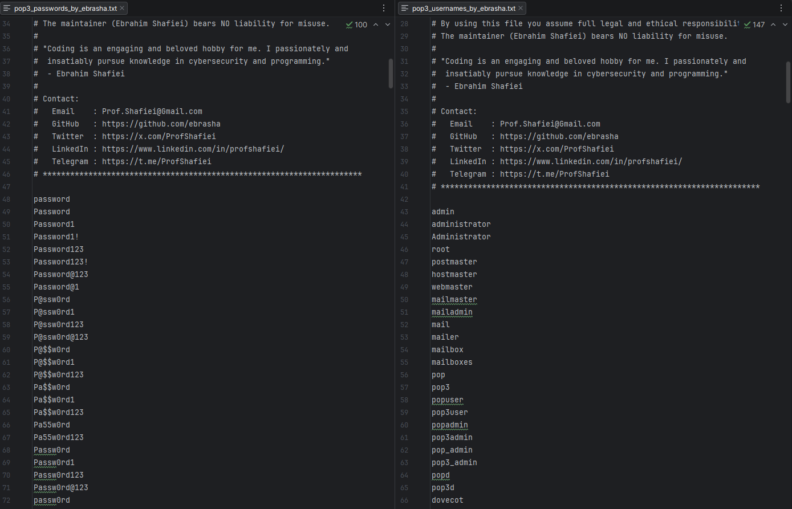

<!-- 
**********************************************************************
 Project Name : POP3 Penetration Testing Wordlists
 File Name    : README.fa.md
 Maintainer   : Ebrahim Shafiei (EbraSha)
 Email        : Prof.Shafiei@Gmail.com
 Created On   : 2026-05-25 08:00:46
 Description  : Persian (Farsi) documentation for the POP3 penetration
                testing wordlists (usernames & passwords) crafted for
                authorized POP3 / POP3S security assessments against
                legacy mailbox accounts.
**********************************************************************
-->

<div align="right">

> 🌐 **مطالعه به زبان شما:** 🇬🇧 [English](README.md) | 🇮🇷 [فارسی](README.fa.md)

</div>

<p align="right">
  
</p>

<div dir="rtl">

# 📮 وردلیست تست نفوذ POP3 — محتمل‌ترین نام‌های کاربری و رمزهای عبور برای Brute Force روی Mailboxهای قدیمی Dovecot، Courier، qpopper، Exchange، Zimbra و ایمیل ISP

### 👤 ابراهیم شفیعی (EbraSha) 🇮🇷

یک پک وردلیست دقیق، واقع‌گرا و با سیگنال بالا، طراحی‌شده به‌طور اختصاصی برای تست نفوذ **مجاز** سرویس‌های **POP3 / POP3S** روی پورت‌های `110` و `995`. این وردلیست بر اساس دیتاست‌های لو رفته، پیش‌فرض‌های وندورها، قراردادهای Role Account، الگوهای نام‌گذاری Mailbox در ISPها و با تمرکز عمدی روی **پسوردهای ده‌ساله و هرگز Rotate نشده** که هنوز روی Mailboxهای قدیمی POP3 بسیار رایج هستند، ساخته شده است.

---

## 📌 چرا این پروژه ساخته شد؟

POP3 **پروتکل فراموش‌شدهٔ Legacy** دنیای ایمیل است — و همین موضوع آن را برای مهاجمان جذاب می‌کند:

- اکانت‌هایی که در ۲۰۲۶ هنوز فعالانه از POP3 استفاده می‌کنند، اغلب **پسوردهای قدیمی، ضعیف و هرگز Rotate نشده** دارند.
- POP3 معمولاً از سیاست‌های Rotation سازمانی **مستثنی** می‌شود.
- یک اعتبارنامهٔ موفق POP3 دسترسی **خواندن و حذف کامل (DELE)** را فراهم می‌کند — مهاجمان می‌توانند کدهای MFA، Reset پسوردها و آلارم‌های امنیتی ورودی را به‌صورت بی‌سروصدا Exfiltrate و سپس Erase کنند.
- POP3 از **۳ کدگذاری مختلف نام کاربری** پشتیبانی می‌کند (`admin`, `admin@domain.tld`, `admin%domain.tld`) — وردلیست‌های عمومی فرم Legacy با `%` را پوشش نمی‌دهند.

این پروژه **دو فایل کوچک، دقیق و با احتمال موفقیت بالا** با پوشش عمدی پسوردهای Legacy/Never-Rotated ارائه می‌دهد (`Password2018`, `Welcome2019`, `Summer2020`) که هنوز روی Mailboxهای POP3 که هیچ‌کس نظارت نمی‌کند زنده هستند.

---

## ✨ ویژگی‌ها و قابلیت‌ها

- 🎯 **اختصاصی POP3**: تنظیم‌شده برای Dovecot، Courier-IMAP/POP، qpopper، Cyrus POP3، Microsoft Exchange / O365 POP3، Zimbra، MDaemon، IceWarp، MailEnable، hMailServer، Kerio Connect، cPanel mail، Plesk mail.
- 📜 **پوشش پسوردهای Legacy**: شامل الگوهای `*2010`–`*2023` فصلی/ادمین/خوشامد که در وردلیست‌های مدرن کم دیده می‌شوند — اما هنوز روی اکانت‌های POP3 هرگز Rotate نشده زنده هستند.
- 📬 **اکانت‌های Role**: `postmaster`, `hostmaster`, `webmaster`, `noreply`, `bounce`, `abuse`, `info`, `support`.
- 🌐 **سه کدگذاری نام کاربری**: Bare (`admin`)، FQ (`admin@<DOMAIN>`) و فرم Legacy ISP (`admin%<DOMAIN>`).
- 👥 **آگاه از الگوی نام‌گذاری**: `first.last@`, `flast@`, `f.last@`, `firstname@`, `lastname@`.
- 🏢 **الگوهای سازمانی و ISP**: رمزهای فصلی، فصلی-سه‌ماهه، ماهانه + پیش‌فرض‌های Customer Portal ISP.
- 🔣 **Leetspeak و جایگزینی کاراکتر**: `M@il@2026`, `Exch@nge@2026`, `Z1mbra@2026`, `4dm1n@123`.
- ⌨️ **رمزهای Keyboard-walk**: `1qaz2wsx`, `qweasdzxc`, `zaq1!QAZ`.
- 🌍 **اعتبارنامه‌های بومی‌سازی‌شده**: ورودی‌های Iran/Tehran/Persia و الگوهای اسامی فارسی.
- 📝 **سازگار با ابزارها**: کامنت‌ها با `#` شروع می‌شوند تا توسط Hydra، Medusa، NetExec، Patator و Ncrack نادیده گرفته شوند.

---

## 📁 فایل‌های این پک

| فایل | کاربرد |
|---|---|
| `pop3_usernames_by_ebrasha.txt` | اکانت‌های Role، ISP/Customer، پیش‌فرض وندور، الگوهای FQ و کدگذاری `%` |
| `pop3_passwords_by_ebrasha.txt` | رمزهای با احتمال بالا با پوشش عمدی Legacy/Never-Rotated |

---

## 🚀 نحوهٔ استفاده

> ⚠️ **توقف**: این وردلیست‌ها را **فقط** علیه سیستم‌هایی استفاده کنید که **مالک آن‌ها هستید** یا **مجوز کتبی صریح** دارید. یک اعتبارنامهٔ موفق POP3 دسترسی کامل خواندن و حذف Mailbox را فراهم می‌کند — یک **یافتهٔ بحرانی (CRITICAL)** که باید فوراً گزارش شود.

### ابتدا `<DOMAIN>` را جایگزین کنید

</div>

```bash
sed -i 's/<DOMAIN>/example.com/g' pop3_usernames_by_ebrasha.txt
```

<div dir="rtl">

### 🐉 Hydra (پورت 995 POP3S — رایج‌ترین)

</div>

```bash
hydra -L pop3_usernames_by_ebrasha.txt -P pop3_passwords_by_ebrasha.txt -s 995 pop3s://<target> -t 1 -W 5
```

<div dir="rtl">

### 🐉 Hydra (پورت 110 STARTTLS / POP3 ساده)

</div>

```bash
hydra -L pop3_usernames_by_ebrasha.txt -P pop3_passwords_by_ebrasha.txt -s 110 pop3://<target> -t 1 -W 5
```

<div dir="rtl">

### 🛡️ Ncrack

</div>

```bash
ncrack -vv --user pop3_usernames_by_ebrasha.txt -P pop3_passwords_by_ebrasha.txt pop3://<target>:110 pop3s://<target>:995
```

<div dir="rtl">

### 🔧 Medusa

</div>

```bash
medusa -h <target> -U pop3_usernames_by_ebrasha.txt -P pop3_passwords_by_ebrasha.txt -M pop3 -n 995 -s
```

<div dir="rtl">

### 🧪 Patator

</div>

```bash
patator pop_login host=<target> port=995 ssl=1 user=FILE0 password=FILE1 0=pop3_usernames_by_ebrasha.txt 1=pop3_passwords_by_ebrasha.txt -x ignore:fgrep='-ERR'
```

<div dir="rtl">

### 🔍 Nmap NSE

</div>

```bash
nmap -p 110,995 --script pop3-brute --script-args userdb=pop3_usernames_by_ebrasha.txt,passdb=pop3_passwords_by_ebrasha.txt <target>
```

<div dir="rtl">

### 💧 استراتژی توصیه‌شده

۱. **همیشه ابتدا بررسی کنید که POP3 روی M365 / Google Workspace واقعاً فعال است یا نه** — اغلب به‌صورت پیش‌فرض غیرفعال است؛ اگر فعال باشد، اکانت‌هایی که از آن استفاده می‌کنند معمولاً Mailboxهای Legacy با بهداشت پایین هستند.  
۲. از **Password Spraying** (یک رمز روی چند یوزر) استفاده کنید — Lockout در Exchange/M365 به‌صورت Per-User-Per-IP اعمال می‌شود.  
۳. **به‌شدت پسوردهای Legacy را تست کنید** (`*2018`, `*2019`, `*2020`, `*2021`) — این‌ها روی POP3 بسیار بیشتر از هر پروتکل دیگری هیت می‌دهند.  
۴. **حداقل ۳۰ ثانیه تأخیر** بین تلاش‌ها برای فرار از Smart Lockout بگذارید.  
۵. **همیشه POP3S (995) را به POP3 ساده (110) ترجیح دهید** — POP3 اعتبارنامه‌ها را Cleartext می‌فرستد.  
۶. **هر گونه احراز هویت موفق را فوراً گزارش دهید** — POP3 امکان حذف بی‌سروصدای ایمیل‌های MFA/Reset/Audit ورودی را فراهم می‌کند و یک وکتور بحرانی Lateral Movement و Persistence است.

---

## ⚠️ تذکر قانونی و اخلاقی

این وردلیست صرفاً برای تست امنیتی **مجاز**، عملیات Red Team، ارزیابی آسیب‌پذیری و پژوهش‌های آموزشی ارائه شده است. استفاده از آن بدون **مجوز کتبی صریح**، **غیرقانونی** است و ممکن است قوانین محلی، ملی و بین‌المللی را نقض کند.

با استفاده از این فایل، شما موافقت می‌کنید که:

۱. برای هر هدف، مجوز کتبی صریح در اختیار دارید.  
۲. مسئولیت کامل قانونی و اخلاقی استفاده را می‌پذیرید.  
۳. نگه‌دارنده (ابراهیم شفیعی) **هیچ‌گونه مسئولیتی** در قبال سوءاستفاده ندارد.

---

## 🐛 گزارش مشکلات

اگر با مشکلی مواجه شدید یا در پیکربندی مشکل دارید، لطفاً از طریق ایمیل Prof.Shafiei@Gmail.com با ما در تماس باشید. همچنین می‌توانید مشکلات را در GitHub گزارش دهید.

## ❤️ حمایت مالی

اگر این پروژه برای شما مفید بود و مایل به حمایت از توسعهٔ بیشتر هستید، لطفاً در نظر داشته باشید که کمک مالی کنید:

- [اینجا اهدا کنید](https://t.me/AbdalDonationBot)

## 🤵 نگه‌دارنده

با عشق ایجاد و نگهداری شده توسط **ابراهیم شفیعی (EbraSha)**

- **ایمیل**: Prof.Shafiei@Gmail.com
- **تلگرام**: [@ProfShafiei](https://t.me/ProfShafiei)

</div>
