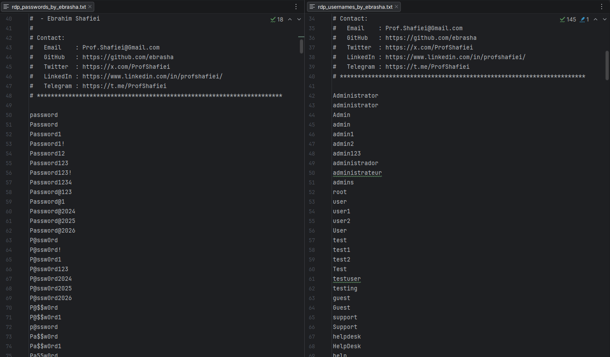

<!-- 
**********************************************************************
 Project Name : RDP Penetration Testing Wordlists
 File Name    : README.md
 Maintainer   : Ebrahim Shafiei (EbraSha)
 Email        : Prof.Shafiei@Gmail.com
 Created On   : 2026-05-25 07:37:00
 Description  : English documentation for the RDP penetration testing
                wordlists (usernames & passwords) crafted for
                authorized Windows RDP security assessments.
**********************************************************************
-->

<div align="right">

[فارسی 🇮🇷](README.fa.md) | **English 🇬🇧**

</div>

<p align="right">
  
</p>

# 🔐 RDP Penetration Testing Wordlists — High-Probability Usernames & Passwords for Windows Remote Desktop Brute Force / Password Spraying

### 👤 Ebrahim Shafiei (EbraSha) 🇮🇷

A curated, real-world, high-signal wordlist pack tailored specifically for **authorized** penetration testing of **Microsoft Windows RDP (Remote Desktop Protocol)** services on port `3389`. Built from breach corpora, vendor defaults, corporate password policies, seasonal patterns, and administrator habits commonly observed on production servers.

---

## 📌 Why This Project Exists

Most public wordlists (`rockyou.txt`, `SecLists`, etc.) are **too large, too generic, or too noisy** for RDP engagements. Windows RDP has unique characteristics that make general-purpose lists inefficient and dangerous:

- **Default account lockout policies** disable accounts after 3–5 failed attempts.
- **NTLM / Kerberos authentication** quickly fills event logs and triggers SIEM alerts.
- **Domain-joined hosts** require targeted, low-volume **password spraying**, not high-speed brute force.
- **Real-world admins** reuse a small, predictable set of patterns (seasonal, vendor, policy-compliant).

This project solves these problems by shipping **two small, surgical, high-probability files** instead of millions of noisy candidates — maximizing the chance of a successful login per request, and minimizing detection and lockouts.

---

## ✨ Features & Capabilities

- 🎯 **RDP-focused**: Tuned for Windows Server, Active Directory, and corporate workstation environments.
- 🧠 **High-signal, low-volume**: Quality over quantity — engineered for **password spraying**, not blind brute force.
- 🏢 **Real-world enterprise patterns**: Seasonal (`Summer2025!`), quarterly (`Q1@2026`), and monthly (`June2026`) passwords commonly enforced by 90-day rotation policies.
- 🔧 **Vendor & service defaults**: VMware, Veeam, Cisco, Fortinet, Citrix, Synology, iLO, iDRAC, IPMI, Oracle, MSSQL, and more.
- 👥 **Service & admin accounts**: `svc_sql`, `svc_backup`, `svc_veeam`, `svc_exchange`, `krbtgt`, `DefaultAccount`, `WDAGUtilityAccount`, etc.
- ☁️ **Cloud & hybrid identities**: Azure AD, Office 365, AWS (`ec2-user`), Intune, SharePoint, Teams admins.
- 🔣 **Leetspeak & substitution patterns**: `P@55w0rd`, `4dm1n@123`, `W1nd0ws!`, `S3rv3r@2026`.
- ⌨️ **Keyboard-walk passwords**: `1qaz2wsx`, `qweasdzxc`, `zaq1!QAZ`, `1qaz!QAZ`.
- 🌍 **Localized credentials**: Includes Iran/Tehran-themed entries and common Persian first-name patterns.
- ⚖️ **Policy-compliant**: All entries meet typical AD complexity requirements (length ≥ 8, uppercase, digit, symbol).
- 📝 **Tool-friendly headers**: Comments are prefixed with `#` so Hydra, Medusa, CrackMapExec, NetExec, and Ncrack ignore them automatically.

---

## 📁 Files in This Pack

| File | Lines | Purpose |
|---|---|---|
| `rdp_usernames_by_ebrasha.txt` | ~300 | Default Windows, service, vendor, role-based, and cloud accounts |
| `rdp_passwords_by_ebrasha.txt` | ~600 | High-probability, policy-compliant passwords used in real environments |

---

## 🚀 How To Use

> ⚠️ **STOP**: Use these wordlists ONLY against systems you **own** or have **explicit written authorization** to test. Unauthorized use is a criminal offense.

### 🔧 NetExec / CrackMapExec (recommended)

```bash
netexec rdp <target> -u rdp_usernames.txt -p rdp_passwords.txt --continue-on-success
```

### 🐉 Hydra (slow, lockout-safe)

```bash
hydra -L rdp_usernames.txt -P rdp_passwords.txt rdp://<target> -t 1 -W 3
```

### 🛡️ Ncrack

```bash
ncrack -vv --user rdp_usernames.txt -P rdp_passwords.txt rdp://<target>
```

### 💧 Recommended Password Spraying Strategy

To avoid account lockouts and SIEM alerts:

1. Test **one password against all usernames** before moving to the next password.
2. Add a **delay of 30+ minutes** between rounds to reset the lockout counter window.
3. Always check the **domain lockout policy** first (`net accounts /domain`).
4. Start with **seasonal / current-year** passwords (`Summer2026!`, `Winter@2026`) — they have the highest hit rate.

---

## ⚠️ Legal & Ethical Notice

This wordlist is provided strictly for **authorized** security testing, red team operations, vulnerability assessments, and educational research. Using it against any system, network, or account without **explicit written permission** from the legitimate owner is **ILLEGAL** and may violate local, national, and international laws (Computer Fraud and Abuse Act, GDPR, and similar legislation).

By using this file you agree that:

1. You possess explicit written authorization for every target.
2. You assume full legal and ethical responsibility for your use.
3. The maintainer (Ebrahim Shafiei) bears **NO liability** for any misuse, damage, or unlawful activity performed with this list.

---

## 🐛 Reporting Issues

If you encounter any issues or have configuration problems, please reach out via email at Prof.Shafiei@Gmail.com. You can also report issues on GitHub.

## ❤️ Donation

If you find this project helpful and would like to support further development, please consider making a donation:

- [Donate Here](https://t.me/AbdalDonationBot)

## 🤵 Maintained by

Maintained with Passion by **Ebrahim Shafiei (EbraSha)**

- **E-Mail**: Prof.Shafiei@Gmail.com
- **Telegram**: [@ProfShafiei](https://t.me/ProfShafiei)
