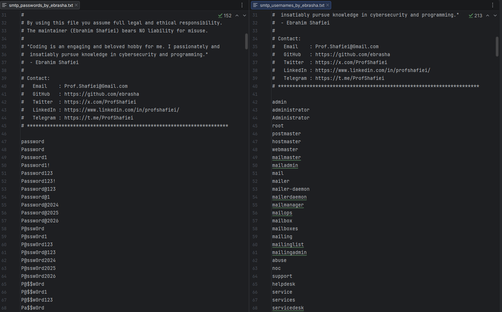

<!-- 
**********************************************************************
 Project Name : SMTP Penetration Testing Wordlists
 File Name    : README.fa.md
 Maintainer   : Ebrahim Shafiei (EbraSha)
 Email        : Prof.Shafiei@Gmail.com
 Created On   : 2026-05-25 08:00:46
 Description  : Persian (Farsi) documentation for the SMTP penetration
                testing wordlists (usernames & passwords) crafted for
                authorized SMTP AUTH / relay security assessments.
**********************************************************************
-->

<div align="right">

> 🌐 **مطالعه به زبان شما:** 🇬🇧 [English](README.md) | 🇮🇷 [فارسی](README.fa.md)

</div>

<p align="right">
  
</p>

<div dir="rtl">

# 📧 وردلیست تست نفوذ SMTP — محتمل‌ترین نام‌های کاربری و رمزهای عبور برای Brute Force AUTH PLAIN / LOGIN روی Postfix، Exim، Sendmail، Exchange، Zimbra، M365 و Relayهای SMTP

### 👤 ابراهیم شفیعی (EbraSha) 🇮🇷

یک پک وردلیست دقیق، واقع‌گرا و با سیگنال بالا، طراحی‌شده به‌طور اختصاصی برای تست نفوذ **مجاز** سرویس **SMTP Authentication** روی پورت‌های `25`، `465`، `587`، `2525`. این وردلیست بر اساس دیتاست‌های لو رفته، پیش‌فرض‌های وندورها، قراردادهای Role Account، فرمت‌های API Key سرویس‌های ایمیل Transactional و دادهٔ تست‌های نفوذ واقعی روی MTAهای On-prem و Relayهای Cloud-bridged ساخته شده است.

---

## 📌 چرا این پروژه ساخته شد؟

SMTP برای مهاجمان **ارزش بسیار بالایی** دارد — یک اعتبارنامهٔ معتبر AUTH معمولاً امکان **BEC، Phishing، تحویل بدافزار و Brand Abuse** را فراهم می‌کند. اما اکثر وردلیست‌های عمومی ویژگی‌های اختصاصی SMTP را پوشش نمی‌دهند:

- SMTP بسته به Config سرور، **هر دو فرم Bare (`admin`) و FQ (`admin@domain.tld`)** را قبول می‌کند.
- **اکانت‌های Role** (`postmaster`, `noreply`, `bounce`, `abuse`) همه‌جا حضور دارند و اغلب رمز ضعیف یا ثابت دارند.
- **Relayهای Cloud** (SendGrid، Mailgun، SES، Postmark) اعتبارنامه‌های اختصاصی SMTP با فرمت API Key قابل پیش‌بینی منتشر می‌کنند.
- **Exchange و M365** از "Smart Lockout" استفاده می‌کنند — Brute Force عمومی فوراً آن را فعال می‌کند.

این پروژه **دو فایل کوچک، دقیق و با احتمال موفقیت بالا** ارائه می‌دهد — موفقیت در اولین تلاش را به حداکثر و ریسک Lockout را به حداقل می‌رساند.

---

## ✨ ویژگی‌ها و قابلیت‌ها

- 🎯 **اختصاصی SMTP**: تنظیم‌شده برای Postfix، Exim، Sendmail، qmail، Dovecot SASL، Microsoft Exchange / O365، Zimbra، MDaemon، IceWarp، MailEnable، hMailServer، Kerio Connect.
- 📬 **اکانت‌های Role در همه‌جا**: `postmaster`, `hostmaster`, `webmaster`, `mailer-daemon`, `noreply`, `bounce`, `abuse`, `noc`, `info`, `support` (اهدافی که تقریباً همیشه موجودند).
- 🌐 **هر دو فرم Bare و FQ**: `admin` و `admin@<DOMAIN>` — قبل از استفاده `<DOMAIN>` را با هدف جایگزین کنید.
- ☁️ **پوشش Relayهای Cloud**: SendGrid (`SG.*`)، Mailgun (`key-*`)، Amazon SES (`AKIA*`)، Postmark، Mailjet، SparkPost، ElasticEmail، Mailtrap، SMTP2GO، TurboSMTP.
- 🛡️ **Applianceهای امنیت ایمیل**: IronPort، Proofpoint، Mimecast، Barracuda، FortiMail، Sophos Email، Trustwave، SpamTitan.
- 🏢 **الگوهای سازمانی**: رمزهای فصلی (`Summer2025!`)، فصلی-سه‌ماهه (`Q1@2026`) و ماهانه (`June2026`) از سیاست‌های Rotation.
- 🔣 **Leetspeak و جایگزینی کاراکتر**: `M@il@2026`, `Exch@nge@2026`, `Z1mbra@2026`, `4dm1n@123`.
- ⌨️ **رمزهای Keyboard-walk**: `1qaz2wsx`, `qweasdzxc`, `zaq1!QAZ`.
- 🌍 **اعتبارنامه‌های بومی‌سازی‌شده**: ورودی‌های Iran/Tehran/Persia و الگوهای اسامی فارسی.
- 🤖 **یکپارچه‌سازی Marketing/CRM/ERP**: Salesforce، Zendesk، Freshdesk، ServiceNow، Jira، SAP، Mailman، phpList، Sympa.
- 📝 **سازگار با ابزارها**: کامنت‌ها با `#` شروع می‌شوند تا توسط Hydra، Medusa، NetExec، Patator و Ncrack نادیده گرفته شوند.

---

## 📁 فایل‌های این پک

| فایل | کاربرد |
|---|---|
| `smtp_usernames_by_ebrasha.txt` | اکانت‌های Role، ادمین/سرویس، پیش‌فرض وندور، الگوهای FQ Email |
| `smtp_passwords_by_ebrasha.txt` | رمزهای با احتمال بالا + فرمت‌های API Key Relayهای Cloud + الگوهای Policy-compliant |

---

## 🚀 نحوهٔ استفاده

> ⚠️ **توقف**: این وردلیست‌ها را **فقط** علیه سیستم‌هایی استفاده کنید که **مالک آن‌ها هستید** یا **مجوز کتبی صریح** دارید. یک اعتبارنامهٔ موفق SMTP AUTH امکان BEC/Phishing را فراهم می‌کند و **باید فوراً گزارش شود**.

### ابتدا `<DOMAIN>` را جایگزین کنید

</div>

```bash
sed -i 's/<DOMAIN>/example.com/g' smtp_usernames_by_ebrasha.txt
```

<div dir="rtl">

### 🐉 Hydra (پورت 587 STARTTLS — رایج‌ترین)

</div>

```bash
hydra -L smtp_usernames_by_ebrasha.txt -P smtp_passwords_by_ebrasha.txt -s 587 smtp://<target> -t 1 -W 5
```

<div dir="rtl">

### 🐉 Hydra (پورت 465 SSL/TLS)

</div>

```bash
hydra -L smtp_usernames_by_ebrasha.txt -P smtp_passwords_by_ebrasha.txt -s 465 smtps://<target> -t 1 -W 5
```

<div dir="rtl">

### 🛡️ Ncrack

</div>

```bash
ncrack -vv --user smtp_usernames_by_ebrasha.txt -P smtp_passwords_by_ebrasha.txt smtp://<target>:587
```

<div dir="rtl">

### 🧪 Patator (انعطاف‌پذیرترین — پشتیبانی از SSL و STARTTLS)

</div>

```bash
patator smtp_login host=<target> port=587 starttls=1 user=FILE0 password=FILE1 0=smtp_usernames_by_ebrasha.txt 1=smtp_passwords_by_ebrasha.txt -x ignore:fgrep='535'
```

<div dir="rtl">

### 🔍 Nmap NSE (Enum + Brute)

</div>

```bash
nmap -p 25,465,587 --script smtp-enum-users,smtp-brute --script-args userdb=smtp_usernames_by_ebrasha.txt,passdb=smtp_passwords_by_ebrasha.txt <target>
```

<div dir="rtl">

### 💧 استراتژی توصیه‌شده

۱. **همیشه ابتدا Enumerate کنید** با `smtp-user-enum`، `VRFY`، `EXPN`، `RCPT TO` تا قبل از Brute Force، Mailboxهای معتبر را تأیید کنید — تعداد تلاش‌ها و احتمال شناسایی را کاهش می‌دهد.  
۲. از **Password Spraying** (یک رمز روی چند یوزر) استفاده کنید — Lockout در Exchange/M365 به‌صورت Per-User-Per-IP اعمال می‌شود.  
۳. **حداقل ۳۰ ثانیه تأخیر** بین تلاش‌ها برای فرار از Smart Lockout بگذارید.  
۴. کار را با **اکانت‌های Role** شروع کنید (`postmaster`, `noreply`, `info`) — این‌ها همه‌جا هستند و معمولاً ضعیف محافظت می‌شوند.  
۵. برای Relayهای Cloud (SendGrid/Mailgun/SES)، ابتدا الگوهای **فرمت API Key** را تست کنید.  
۶. **هر گونه احراز هویت موفق را فوراً گزارش دهید** — Compromise SMTP AUTH ریسک بحرانی BEC/Phishing است.

---

## ⚠️ تذکر قانونی و اخلاقی

این وردلیست صرفاً برای تست امنیتی **مجاز**، عملیات Red Team، ارزیابی آسیب‌پذیری و پژوهش‌های آموزشی ارائه شده است. استفاده از آن بدون **مجوز کتبی صریح**، **غیرقانونی** است و ممکن است قوانین محلی، ملی و بین‌المللی را نقض کند.

با استفاده از این فایل، شما موافقت می‌کنید که:

۱. برای هر هدف، مجوز کتبی صریح در اختیار دارید.  
۲. مسئولیت کامل قانونی و اخلاقی استفاده را می‌پذیرید.  
۳. نگه‌دارنده (ابراهیم شفیعی) **هیچ‌گونه مسئولیتی** در قبال سوءاستفاده ندارد.

---

## 🐛 گزارش مشکلات

اگر با مشکلی مواجه شدید یا در پیکربندی مشکل دارید، لطفاً از طریق ایمیل Prof.Shafiei@Gmail.com با ما در تماس باشید. همچنین می‌توانید مشکلات را در GitHub گزارش دهید.

## ❤️ حمایت مالی

اگر این پروژه برای شما مفید بود و مایل به حمایت از توسعهٔ بیشتر هستید، لطفاً در نظر داشته باشید که کمک مالی کنید:

- [اینجا اهدا کنید](https://t.me/AbdalDonationBot)

## 🤵 نگه‌دارنده

با عشق ایجاد و نگهداری شده توسط **ابراهیم شفیعی (EbraSha)**

- **ایمیل**: Prof.Shafiei@Gmail.com
- **تلگرام**: [@ProfShafiei](https://t.me/ProfShafiei)

</div>
