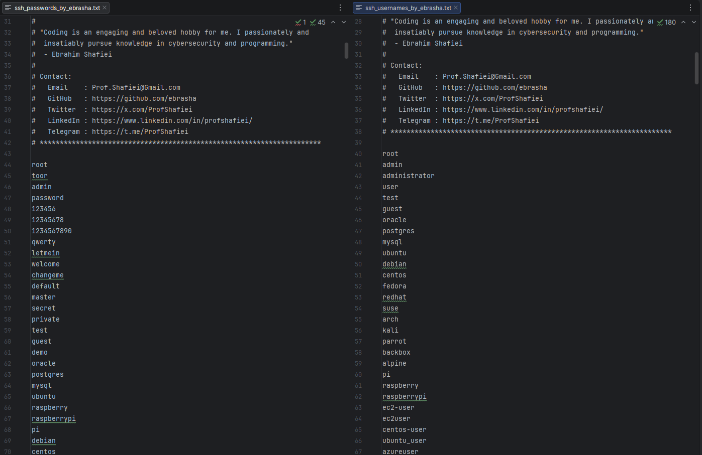

<!-- 
**********************************************************************
 Project Name : SSH Penetration Testing Wordlists
 File Name    : README.fa.md
 Maintainer   : Ebrahim Shafiei (EbraSha)
 Email        : Prof.Shafiei@Gmail.com
 Created On   : 2026-05-25 08:00:46
 Description  : Persian (Farsi) documentation for the SSH penetration
                testing wordlists (usernames & passwords) crafted for
                authorized Linux/Unix/BSD/IoT SSH assessments.
**********************************************************************
-->

<div align="right">

> 🌐 **مطالعه به زبان شما:** 🇬🇧 [English](README.md) | 🇮🇷 [فارسی](README.fa.md)

</div>

<p align="right">
  
</p>

<div dir="rtl">

# 🐧 وردلیست تست نفوذ SSH — محتمل‌ترین نام‌های کاربری و رمزهای عبور برای Brute Force و Password Spraying روی Linux، Unix، BSD، IoT و سرورهای ابری

### 👤 ابراهیم شفیعی (EbraSha) 🇮🇷

یک پک وردلیست دقیق، واقع‌گرا و با سیگنال بالا، طراحی‌شده به‌طور اختصاصی برای تست نفوذ **مجاز** سرویس‌های **OpenSSH و سازگار با SSH** روی پورت `22` (و پورت‌های دلخواه). این وردلیست بر اساس دیتاست‌های لو رفته، پسوردهای پیش‌فرض ونـدورها، ایمیج‌های ابری، دستگاه‌های IoT/Embedded و رایج‌ترین الگوهای ادمین‌های Linux/Unix در محیط‌های Production ساخته شده است.

---

## 📌 چرا این پروژه ساخته شد؟

اکثر وردلیست‌های عمومی مثل `rockyou.txt` یا `SecLists` برای حمله به SSH **بسیار بزرگ، عمومی و پر سر و صدا** هستند. SSH ویژگی‌های منحصربه‌فردی دارد که استفاده از لیست‌های عمومی را ناکارآمد و خطرناک می‌کند:

- ابزارهایی مثل **Fail2ban، sshguard و CrowdSec** پس از چند تلاش ناموفق، IP منبع را Ban می‌کنند.
- **ایمیج‌های ابری** نام‌های کاربری قابل پیش‌بینی دارند (`ec2-user`, `ubuntu`, `centos`, `opc`, `core`) و نه `root`.
- **دستگاه‌های IoT و Embedded** هنوز از پسوردهای پیش‌فرض وندور استفاده می‌کنند (`pi/raspberry`, `root/toor`, `admin/admin`).
- ادمین‌های واقعی از یک مجموعهٔ کوچک، تکراری و قابل پیش‌بینی از الگوها (فصلی، وندوری، Policy-compliant) استفاده می‌کنند.

این پروژه با ارائهٔ **دو فایل کوچک، دقیق و با احتمال موفقیت بالا** به جای میلیون‌ها کاندیدای نویزی، این مشکلات را حل می‌کند — شانس موفقیت در هر درخواست را به حداکثر و احتمال Ban شدن IP و شناسایی را به حداقل می‌رساند.

---

## ✨ ویژگی‌ها و قابلیت‌ها

- 🎯 **اختصاصی SSH**: تنظیم‌شده برای OpenSSH، Dropbear، libssh، Cisco IOS SSH، JunOS SSH و SSH دستگاه‌های Embedded.
- 🧠 **سیگنال بالا، حجم کم**: کیفیت به جای کمیت — مهندسی‌شده برای **Password Spraying** نه Brute Force کور.
- 🐧 **پیش‌فرض‌های Linux/Unix/BSD**: Ubuntu، Debian، CentOS، RHEL، SUSE، Arch، Alpine، FreeBSD، OpenBSD، Solaris، AIX.
- ☁️ **پیش‌فرض‌های ایمیج ابری**: `ec2-user`, `ubuntu`, `centos`, `debian`, `opc`, `core`, `azureuser`, `gcpuser`, `linode`.
- 📦 **اکانت‌های Container و Orchestration**: Docker، Kubernetes، Rancher، OpenShift، Nomad، Consul، Vault.
- 🌐 **پیش‌فرض‌های تجهیزات شبکه**: Cisco، Juniper، MikroTik، Ubiquiti، Fortinet، Palo Alto، Check Point، SonicWall، Huawei.
- 🖥️ **مدیریت Out-of-band**: iLO، iDRAC، IPMI، BMC، Nutanix (شامل `idrac/calvin` و `nutanix/nutanix/4u` معروف).
- 📷 **IoT و Embedded**: Raspberry Pi، دوربین‌های IP (Hikvision، Dahua، Axis)، NAS (Synology، QNAP، TrueNAS).
- 🏢 **الگوهای سازمانی**: رمزهای فصلی (`Summer2025!`)، فصلی-سه‌ماهه (`Q1@2026`) و ماهانه (`June2026`) که توسط سیاست‌های تغییر رمز ۹۰ روزه اعمال می‌شوند.
- 🔣 **الگوهای Leetspeak و جایگزینی کاراکتر**: `r00t@123`, `4dm1n@123`, `L1nux@2026`, `S3rv3r@2026`.
- ⌨️ **رمزهای Keyboard-walk**: `1qaz2wsx`, `qweasdzxc`, `zaq1!QAZ`.
- 🌍 **اعتبارنامه‌های بومی‌سازی‌شده**: شامل رمزهای مرتبط با Iran/Tehran/Persia و الگوهای رایج اسامی فارسی.
- 📝 **سازگار با ابزارها**: کامنت‌ها با `#` شروع می‌شوند تا توسط Hydra، Medusa، NetExec، Patator و Ncrack نادیده گرفته شوند.

---

## 📁 فایل‌های این پک

| فایل | کاربرد |
|---|---|
| `ssh_usernames_by_ebrasha.txt` | اکانت‌های Linux/Unix، ابری، Container، وندوری، IoT و نقش‌های سازمانی |
| `ssh_passwords_by_ebrasha.txt` | رمزهای با احتمال بالا و واقع‌گرا، استفاده‌شده روی هاست‌های در معرض SSH |

---

## 🚀 نحوهٔ استفاده

> ⚠️ **توقف**: این وردلیست‌ها را **فقط** علیه سیستم‌هایی استفاده کنید که **مالک آن‌ها هستید** یا **مجوز کتبی صریح** برای تست آن‌ها دارید. استفادهٔ غیرمجاز جرم محسوب می‌شود.

### 🐉 Hydra (آهسته، ایمن از نظر Fail2ban)

</div>

```bash
hydra -L ssh_usernames_by_ebrasha.txt -P ssh_passwords_by_ebrasha.txt ssh://<target> -t 4 -W 5
```

<div dir="rtl">

### 🔧 NetExec / CrackMapExec

</div>

```bash
netexec ssh <target> -u ssh_usernames_by_ebrasha.txt -p ssh_passwords_by_ebrasha.txt --continue-on-success
```

<div dir="rtl">

### 🛡️ Ncrack

</div>

```bash
ncrack -vv --user ssh_usernames_by_ebrasha.txt -P ssh_passwords_by_ebrasha.txt ssh://<target>:22
```

<div dir="rtl">

### 🧪 Patator (انعطاف‌پذیرترین)

</div>

```bash
patator ssh_login host=<target> user=FILE0 password=FILE1 0=ssh_usernames_by_ebrasha.txt 1=ssh_passwords_by_ebrasha.txt -x ignore:mesg='Authentication failed'
```

<div dir="rtl">

### 💧 استراتژی توصیه‌شده برای Password Spraying

۱. ابتدا **یک رمز را روی تمام نام‌های کاربری** امتحان کنید، سپس به رمز بعدی بروید.  
۲. بین هر تلاش، **حداقل ۶۰ ثانیه تأخیر** بگذارید تا fail2ban / sshguard فعال نشود.  
۳. حتماً ابتدا **سیستم‌عامل / Cloud Provider** را شناسایی کنید (`nmap -sV`) تا نام کاربری درست را انتخاب کنید (`ec2-user` در مقابل `root` در مقابل `pi`).  
۴. کار را با **پیش‌فرض‌های وندورها** شروع کنید (`pi/raspberry`, `idrac/calvin`, `nutanix/nutanix/4u`) — این‌ها روی دستگاه‌های Unmanaged بالاترین نرخ موفقیت را دارند.  
۵. برای سرورهای Policy-compliant، با رمزهای **فصلی سال جاری** شروع کنید (`Summer2026!`, `Winter@2026`).

---

## ⚠️ تذکر قانونی و اخلاقی

این وردلیست صرفاً برای تست امنیتی **مجاز**، عملیات Red Team، ارزیابی آسیب‌پذیری و پژوهش‌های آموزشی ارائه شده است. استفاده از آن علیه هر سیستم، شبکه یا اکانتی **بدون مجوز کتبی صریح** از مالک قانونی، **غیرقانونی** است و ممکن است قوانین محلی، ملی و بین‌المللی (مانند Computer Fraud and Abuse Act، GDPR و قوانین مشابه) را نقض کند.

با استفاده از این فایل، شما موافقت می‌کنید که:

۱. برای هر هدف، مجوز کتبی صریح در اختیار دارید.  
۲. مسئولیت کامل قانونی و اخلاقی استفاده را می‌پذیرید.  
۳. نگه‌دارنده (ابراهیم شفیعی) **هیچ‌گونه مسئولیتی** در قبال سوءاستفاده، خسارت یا فعالیت غیرقانونی انجام‌شده با این لیست ندارد.

---

## 🐛 گزارش مشکلات

اگر با مشکلی مواجه شدید یا در پیکربندی مشکل دارید، لطفاً از طریق ایمیل Prof.Shafiei@Gmail.com با ما در تماس باشید. همچنین می‌توانید مشکلات را در GitHub گزارش دهید.

## ❤️ حمایت مالی

اگر این پروژه برای شما مفید بود و مایل به حمایت از توسعهٔ بیشتر هستید، لطفاً در نظر داشته باشید که کمک مالی کنید:

- [اینجا اهدا کنید](https://t.me/AbdalDonationBot)

## 🤵 نگه‌دارنده

با عشق ایجاد و نگهداری شده توسط **ابراهیم شفیعی (EbraSha)**

- **ایمیل**: Prof.Shafiei@Gmail.com
- **تلگرام**: [@ProfShafiei](https://t.me/ProfShafiei)

</div>
