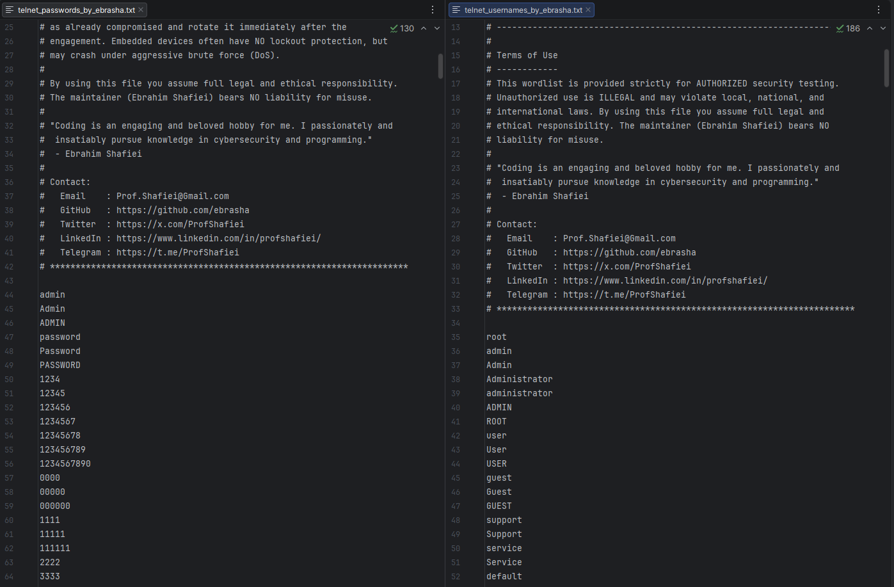

<!-- 
**********************************************************************
 Project Name : Telnet Penetration Testing Wordlists
 File Name    : README.md
 Maintainer   : Ebrahim Shafiei (EbraSha)
 Email        : Prof.Shafiei@Gmail.com
 Created On   : 2026-05-25 08:00:46
 Description  : English documentation for the Telnet penetration
                testing wordlists (usernames & passwords) crafted for
                authorized IoT / router / camera / ICS / legacy Unix
                Telnet assessments.
**********************************************************************
-->

<div align="right">

> 🌐 **Read in your language:** 🇬🇧 [English](README.md) | 🇮🇷 [فارسی](README.fa.md)

</div>

<p align="right">
  
</p>

# 📡 Telnet Penetration Testing Wordlists — High-Probability Credentials for IoT, Routers, IP Cameras, DVR/NVR, ICS/SCADA, VoIP & Legacy Unix Telnet Brute Force

### 👤 Ebrahim Shafiei (EbraSha) 🇮🇷

A curated, real-world, high-signal wordlist pack tailored specifically for **authorized** penetration testing of **Telnet** services on ports `23`, `2323`, `4567`, `5555` and other custom embedded ports. Built from **Mirai / Mozi / Gafgyt botnet seed credentials**, vendor default databases, public CVE disclosures, and real-world pentest engagements on telecom CPE, IP cameras, DVR/NVR, switches, VoIP phones, ICS/SCADA consoles and legacy Unix hosts.

---

## 📌 Why This Project Exists

Telnet is the **single biggest attack surface in the IoT world** and behaves completely differently from SSH or RDP:

- **No transport encryption** — credentials traverse the wire in cleartext.
- **No native lockout** on most embedded firmware — brute force is unconstrained but can **crash devices** (DoS).
- **Massive vendor-default exposure** — most IoT/CPE/CCTV ships with factory creds that owners never change.
- **Botnet history** — Mirai-class malware has been weaponizing the same ~60 credential pairs for years; those creds still work in 2026 on millions of devices.

This project ships **two small, surgical, high-probability files** distilled from Mirai's `scanner.c` table, vendor default databases (RouterPasswords, DefaultPassword.us, ICS-CERT advisories) and real engagements — maximizing first-shot hit rate on real-world IoT/embedded targets.

---

## ✨ Features & Capabilities

- 🎯 **Telnet-focused**: Tuned for embedded BusyBox, Cisco IOS, JunOS, MikroTik RouterOS, Huawei VRP, ZTE ZXR/ZXA, ZyXEL ZyNOS, OpenWrt and BSD/Unix legacy hosts.
- 🦠 **Mirai / Mozi / Gafgyt seed creds**: `root:xc3511`, `root:vizxv`, `root:xmhdipc`, `root:juantech`, `root:jvbzd`, `root:7ujMko0admin`, `root:hi3518`, `root:hi3520`, `root:hi3531`, `root:hi3535`, `root:klv123`, `root:Zte521`, `root:zlxx` and dozens more.
- 📡 **Telecom CPE defaults**: Huawei (HG532, HG658, HG8245, EchoLife), ZTE (ZXHN, ZXDSL), Calix, Sumitomo, Telkom, AdminTelecom; common ISP-rebrand creds like `admin/admin@huawei.com`, `admin/W@ifi-default`, `admin/ALC#FGU`.
- 📷 **IP camera & DVR**: Hikvision, Dahua, Foscam, Axis, Mobotix, Bosch, Sony, Panasonic, Vivotek, Acti, GeoVision, TVT, HiSilicon, XMEye — all known factory creds included.
- 🌐 **Router/switch/AP**: Cisco (incl. `enable secret`), Juniper, MikroTik, Ubiquiti/UniFi, EdgeMAX, TP-Link, D-Link, Netgear, Linksys, ASUS, Belkin, TrendNet, ZyXEL, Buffalo.
- 🏭 **ICS / SCADA / OT**: Siemens (SIMATIC, S7), Allen-Bradley/Rockwell, Modicon/Schneider, Omron, Mitsubishi, ABB, Honeywell, Yokogawa, GE, Emerson — for **authorized** OT assessments only.
- ☎️ **VoIP / IP phones**: Polycom (`PlcmSpIp/PlcmSpIp`, `polycom/456`), Yealink, Grandstream, Fanvil, Mitel, ShoreTel, Avaya, Asterisk, Elastix, FreePBX, FreeSWITCH, 3CX, ATA boxes (PAP2T).
- 🔣 **Leetspeak & substitution patterns**: `r00t@123`, `4dm1n@123`, `P@55w0rd`.
- 🌍 **Localized credentials**: Iran / Tehran / Persia-themed entries and common Persian first-name patterns.
- 📝 **Tool-friendly headers**: Comments prefixed with `#` so Hydra, Medusa, NetExec, Patator, Ncrack ignore them.

---

## 📁 Files in This Pack

| File | Purpose |
|---|---|
| `telnet_usernames_by_ebrasha.txt` | IoT, vendor, telecom CPE, camera, ICS, VoIP and legacy Unix accounts |
| `telnet_passwords_by_ebrasha.txt` | Mirai-class seed creds + vendor defaults + real-world Telnet passwords |

---

## 🚀 How To Use

> ⚠️ **STOP**: Use these wordlists ONLY against systems you **own** or have **explicit written authorization** to test. Many embedded devices may crash under brute force (DoS) — coordinate with the owner first.

### 🐉 Hydra (recommended, slow & device-safe)

```bash
hydra -L telnet_usernames_by_ebrasha.txt -P telnet_passwords_by_ebrasha.txt telnet://<target> -t 2 -W 3
```

### 🛡️ Ncrack

```bash
ncrack -vv --user telnet_usernames_by_ebrasha.txt -P telnet_passwords_by_ebrasha.txt telnet://<target>:23
```

### 🔧 Medusa

```bash
medusa -h <target> -U telnet_usernames_by_ebrasha.txt -P telnet_passwords_by_ebrasha.txt -M telnet
```

### 🧪 Patator

```bash
patator telnet_login host=<target> port=23 user=FILE0 password=FILE1 0=telnet_usernames_by_ebrasha.txt 1=telnet_passwords_by_ebrasha.txt persistent=0
```

### 🔍 Nmap NSE quick check

```bash
nmap -p 23,2323,4567,5555 --script telnet-brute --script-args userdb=telnet_usernames_by_ebrasha.txt,passdb=telnet_passwords_by_ebrasha.txt <target>
```

### 💧 Recommended Strategy

1. **Capture the banner first** (`nc <target> 23` or `nmap -sV -p 23 <target>`) — the banner usually reveals the vendor and exact model, which lets you pick **3–5 surgical credential pairs** instead of full brute force.
2. Prefer **`-t 1` or `-t 2`** (low thread count) — many embedded devices crash above 4 concurrent sessions.
3. Always test the **vendor-default pair** (e.g. `root/xc3511`, `admin/admin`, `Polycom/456`) before launching the full list.
4. Telnet **transmits cleartext** — assume any credential you find is already in attacker hands; rotate immediately.
5. On ICS/SCADA targets, **do NOT brute force** — only validate one or two known-default pairs with explicit OT engineer approval to avoid disrupting physical processes.

---

## ⚠️ Legal & Ethical Notice

This wordlist is provided strictly for **authorized** security testing, red team operations, vulnerability assessments, and educational research. Using it without **explicit written permission** is **ILLEGAL** and may violate local, national, and international laws.

By using this file you agree that:

1. You possess explicit written authorization for every target.
2. You assume full legal and ethical responsibility.
3. The maintainer (Ebrahim Shafiei) bears **NO liability** for any misuse, damage, device crashes, or unlawful activity performed with this list.

---

## 🐛 Reporting Issues

If you encounter any issues or have configuration problems, please reach out via email at Prof.Shafiei@Gmail.com. You can also report issues on GitHub.

## ❤️ Donation

If you find this project helpful and would like to support further development, please consider making a donation:

- [Donate Here](https://t.me/AbdalDonationBot)

## 🤵 Maintained by

Maintained with Passion by **Ebrahim Shafiei (EbraSha)**

- **E-Mail**: Prof.Shafiei@Gmail.com
- **Telegram**: [@ProfShafiei](https://t.me/ProfShafiei)
